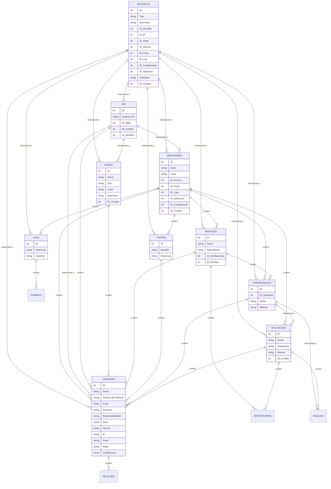

# Inventario

### 1. **Definição de Requisitos e Escopo**
   - **Identifique os Itens de Configuração (ICs)**: Liste os tipos de ICs que você deseja rastrear (hardware, software, redes, documentos, serviços, etc.).
   - **Defina os Atributos dos ICs**: Determine quais informações você precisa rastrear para cada IC (por exemplo, modelo, número de série, localização, status, responsável).
   - **Funcionalidades Necessárias**: Pense em funcionalidades como rastreamento de mudanças, relatórios, alertas de manutenção, integrações com outras ferramentas, etc.

### 2. **Escolha da Plataforma**
   - **Google AppSheet**: É uma boa escolha para um rápido desenvolvimento e fácil manutenção.
   - **Outras Plataformas**: Avalie outras plataformas de desenvolvimento low-code/no-code se você tiver requisitos específicos que o AppSheet não possa atender.

### 3. **Design da Base de Dados**
   - **Estruture a Fonte de Dados**: Crie uma ou várias tabelas (por exemplo, em Google Sheets) para armazenar os dados dos ICs. Certifique-se de que a estrutura esteja clara e bem organizada.
   - **Relacionamentos entre Dados**: Se necessário, estabeleça relações entre diferentes tabelas (por exemplo, ICs e departamentos, ICs e tickets de suporte).

### 4. **Criação do Aplicativo**
   - **Conexão de Dados**: No AppSheet, conecte sua fonte de dados.
   - **Criação de Views**: Desenvolva diferentes visualizações para diferentes tipos de usuários (técnicos de TI, gerentes, suporte, etc.).
   - **Funcionalidades Personalizadas**: Implemente funções para adicionar, editar e deletar registros, além de visualizar relatórios e alertas.

### 5. **Teste e Feedback**
   - **Teste Interno**: Use o aplicativo internamente para identificar bugs ou melhorias necessárias.
   - **Coleta de Feedback**: Obtenha feedback dos usuários para entender o que pode ser melhorado.

### 6. **Implantação e Treinamento**
   - **Lançamento Oficial**: Após ajustes, lance o aplicativo para os usuários finais.
   - **Treinamento e Documentação**: Forneça treinamento e documentação adequados para garantir que todos possam usar o aplicativo eficientemente.

### 7. **Manutenção e Atualização Contínua**
   - **Monitoramento**: Monitore o uso do aplicativo e colete dados sobre seu desempenho.
   - **Atualizações Regulares**: Faça atualizações com base no feedback contínuo e nas mudanças nas necessidades de negócios.

### Dicas Adicionais
- **Integrações**: Considere integrar seu aplicativo com outras ferramentas usadas em sua organização (como sistemas de ticketing).
- **Segurança e Controle de Acesso**: Estabeleça níveis de acesso e controles de segurança para proteger as informações sensíveis.
- **Escalabilidade**: Projete a aplicação pensando na escalabilidade para lidar com o crescimento da organização e o aumento no número de ICs.

https://chat.openai.com/share/325c8673-aab2-4d0b-8b9e-c7ff59da0f76

--------------

### Entidades e Atributos

1. **MUDANÇAS**
   - Atributos: ID, Tipo, Descrição, ID_Servidor, ID_IP, ID_Rede, ID_Serviço, ID_Porta, ID_Log, ID_Configuração, ID_Aplicação, Chamado, ID_Contato

2. **SERVIDORES**
   - Atributos: ID, Nome, Local, ID_Serviço, ID_Porta, ID_Logs, ID_Aplicação, ID_Configuração, ID_Contato

3. **IPS**
   - Atributos: ID, Endereço-IP, ID_Rede, ID_Contato, ID_Servidor

4. **REDES**
   - Atributos: ID, Nome, Tipo, Local, Descrição, ID_Contato

5. **SERVIÇOS**
   - Atributos: ID, Nome, Repositórios, ID_Configuração, ID_Contato

6. **PORTAS**
   - Atributos: ID, Número, Descrição

7. **LOGS**
   - Atributos: ID, Descrição, Caminho

8. **CONFIGURAÇÃO**
   - Atributos: ID, ID_Aplicação, Nome, Manual

9. **APLICAÇÕES**
   - Atributos: ID, Nome, Repositório, Manual, ID_Contato

10. **CONTATOS**
    - Atributos: ID, Nome, Número-de-Telefone, Email, Empresa, Responsabilidade, Nível, Serviço, IP, Porta, Rede, Configuração

### Relações

- **MUDANÇAS** está relacionado a várias entidades, como SERVIDORES, IPS, REDES, SERVIÇOS, PORTAS, LOGS, CONFIGURAÇÃO, APLICAÇÕES e CONTATOS.
- **SERVIDORES** contém SERVIÇOS, PORTAS, LOGS, APLICAÇÕES, CONFIGURAÇÃO e CONTATOS.
- **IPS** está relacionado a REDES, CONTATOS e SERVIDORES.
- **REDES** contém CONTATOS.
- **SERVIÇOS** contém REPOSITÓRIOS, CONFIGURAÇÃO e CONTATOS.
- **PORTAS** contém CONTATOS.
- **LOGS** contém CAMINHO.
- **CONFIGURAÇÃO** está relacionada a APLICAÇÕES e MANUAIS, e contém CONTATOS.
- **APLICAÇÕES** contém REPOSITÓRIOS, MANUAIS e CONTATOS.
- **CONTATOS** contém DETALHES.

https://chat.openai.com/share/39208bf0-32db-43ce-8b7d-53288cd17d82

-----------

